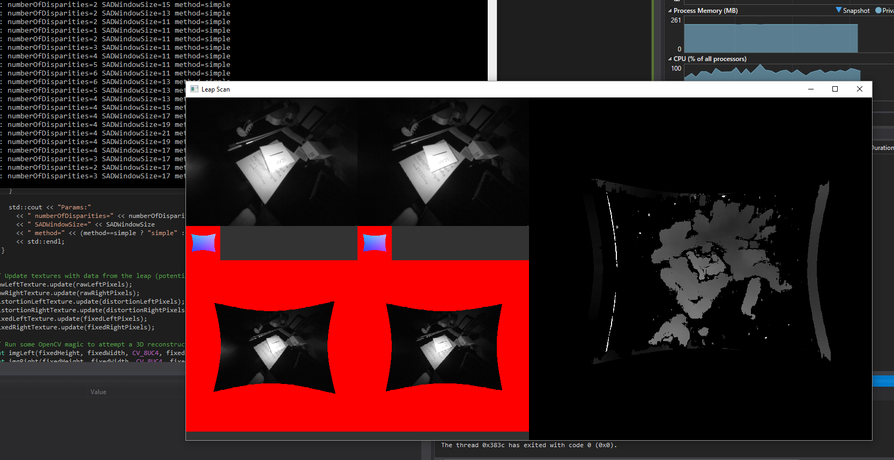

# LeapScan

I bought a Leap Motion years ago and despite a few hack day projects here and there it doesn't get much use. While talking about 3d scanning tools I figured I'd see if the Leap could do it as aside from a 1st gen Kinect I don't have anything which has decent stero cameras.

A brief search online didn't turn up much, and definitely nothing decent so I thought I'd have a quick attempt over a weekend.

The attempt was mostly a failure, but hey.

This project reads and displays images from the Leap, un-distorts them on the CPU, and attempts to reconstruct a 3d scene from the stereo images using a couple of method from OpenCV.

## Example

This is a screenshot of an attempted scan of my desk. It makes something semi-recognisable...

## Requirements

Should you be crazy enough to want to give this project a test you'll need:

- Visual Studio 2015
- SFML 2.3.2
- Leap SDK 2.3.1+31549
- OpenCV 3.1.0

The project config will need tweaking as I set it up fairly badly and it only works for 64bit as I wasn't aiming for portability.

## TODO

- Get the distortion-removal running as a GPU shader
- Use the OpenCV GPU-based stereo solver
- Sort out lighting issues from the Leap
- Crop the leap images before solving
